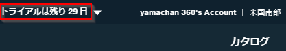

# 初めての Bluemix

ぼんやりと情報を眺めていると「クラウド」って何のことだかさっぱりわからなくなる。

昔からある製品やサービスも、クラウドって流行り言葉で売ろうとしていないか？厳密に言えばクラウドって何なのさ？など疑心暗鬼になってしまう僕は、まあ、オールドタイプの開発者の一人です。

いろいろ長所があるみたいですが、個人で使う場合は

* クリックひとつで簡単にどこかに作られる仮想Linuxマシン
* よく使うサーバー構成(LAMPとか)はいろいろ用意されてて選ぶだけで楽々
* Webで簡単に管理できるマシンで、電源ON/OFFやメモリ追加、マシン数増やすのも自由

ぐらいの理解でいいのかな、と。

## とりあえず登録

とりあえず Buemix に登録してみました！上に無料期間が表示されています。



この無料期間ですが [クラウドサービスIBM Bluemixを無料で使うノウハウまとめ](http://qiita.com/zuhito/items/86e7ad47d14937d3e9b6) によると「30日間は、ほぼ全ての機能を無料で利用できる」らしいです。

確かにメール登録だけで、カード番号など決済情報は入力してないので、IBMさんも請求できないですよね。トライアル期間の終わりにはいったん全消ししてもいい、ぐらいの感じで気楽に使ってみます。

## アプリを作成してみる

さて始めようと「アプリを追加」ボタンを押すと、ああ、駄目ですよIBMさん。いきなりフルコースのメニュー並べてどうするんですか？お勧めメニューとか無いと、初心者ここでサヨナラですよー。


僕もここで戸惑いまして、いろいろググってみた結果、なんとなくわかってきました。ざっくり言うと、

ボイラーテンプレートがIBMさんの提供する、お勧めというか基本的なサーバー環境みたい。

Cloud Foundry アプリですが、CFがオープンソースのPaaS(Platform as a Service)ソフトウェアのようです。CFコミュニティで作成された仮想マシンの設定があって、Blluemixでも利用できるみたい。

コンテナも同様に、Dockerというシンプルで軽量な仮想環境があって、それ用の仮想環境の設定みたいですね。カタログにはあまり数はなくて、独自のDockerイメージをアップロードするのが基本の様子。

OpenWhisk は、オープンソースの関数ベースの環境のようで「使用していないときには、コストは一切かかりません」とあるのが魅力的です。が、特殊っぽいので今回はパス。モバイルもパス。

たぶんですが、Blluemix は後発のクラウド環境なので、CF / Docker という既存の資産を流用できるようになっているのではないでしょうか。個人的な印象ですが、ボイラーテンプレートがわりと重装備で、CF、コンテナとだんだん軽くなっていく印象です。

## SDK for Node.js 君に決めた！

とりあえず選んでみたのは CF の「SDK for Node.js」です。ボイラーテンプレートにも Node.js あったんですが、とりあえず最初はDB無くていいかな、と。


名前とか適当に入力しましたが、ホスト名がけっこう被ります。「作成」ボタン押すまで被りを知らせてくれないので、ちょっと大変ですな。


作成ボタンを押して30秒もしないうちに、仮想マシンのセットアップが実施されて起動しちゃいました。


この簡単さ、やってみるとやはり衝撃的ですねぇ。

## cf ツールを使ってみる

アプリの追加直後に表示される「開始」ページに、いろいろ入門者向けの情報が載っています。

まだ導入していない場合は、cf コマンドを導入するのをお勧めします。私は Windows 64bit バイナリ版を [ダウンロードページ](https://github.com/cloudfoundry/cli#downloads) からダウンロードして、中にあった cf.exe をパスの通ったディレクトリにコピーしました。

ちなみに cf を単に実行すると、すごくたくさんのオプションの説明が出てきて驚きます。まあ、必要なのから覚えていきましょう。

早速 cf を使って、ガイドにある API endpoint の指定とログオンをしてみます。僕は米国南部なんで…


いけました！これで仮想マシンで遊べそうです。

## さてどうなっているのか

cf コマンドにはいろんな機能があるのですが、僕が注目したのは ssh 機能です。コレ使えば、普通のLinuxマシンのようにシェル起動して、中身を覗けるんじゃない？という安易な考えで。


なんか普通に ssh 効きました。そして Node.js 関連しか動いていない、めっちゃ基本的なLinux環境が用意されているように伺えます。

なんかすっごく、親近感がわいてきましたよ。

とりあえず cf ssh "Node.js Test" -c "env" で書き出した結果がコチラ。CF_* と VCAP_* は外してあります。

```sh
BLUEMIX_REGION=ibm:yp:us-south
TERM=xterm
USER=vcap
PATH=/bin:/usr/bin
PWD=/home/vcap
LANG=en_US.UTF-8
VCAP_SERVICES={}
SHLVL=1
HOME=/home/vcap
INSTANCE_INDEX=0
PORT=8080
INSTANCE_GUID=80670309-8ebc-4e11-5969-799a5cb1f514
VCAP_APP_HOST=0.0.0.0
MEMORY_LIMIT=256m
_=/usr/bin/env
```

そして cf ssh "Node.js Test" -c "cat app/.app-management/scripts/start" で書き出した結果がコチラ。

```sh
#!/usr/bin/env bash
# IBM SDK for Node.js Buildpack
# Copyright 2014 the original author or authors.
#
# Licensed under the Apache License, Version 2.0 (the "License");
# you may not use this file except in compliance with the License.
# You may obtain a copy of the License at
#
#      http://www.apache.org/licenses/LICENSE-2.0
#
# Unless required by applicable law or agreed to in writing, software
# distributed under the License is distributed on an "AS IS" BASIS,
# WITHOUT WARRANTIES OR CONDITIONS OF ANY KIND, either express or implied.
# See the License for the specific language governing permissions and
# limitations under the License.

function set_node_executable() {
  if ! NODE=$(${app_management_dir}/utils/get-node-executable ${BREAK}); then
    echo "Failed to determine NODE_EXECUTABLE" >&2
    exit 2
  fi
  export NODE_EXECUTABLE="${NODE}"
}

export PORT="$1"
if [ -n "$VCAP_APP_PORT" ]; then
  export VCAP_APP_PORT=$1
fi
BREAK="${2:-no-break}" # This form sets BREAK to "no-break" if $2 is empty

app_dir=$(cd `dirname $0`/../.. && pwd)
cd $app_dir
app_management_dir=$(cd .app-management && pwd)

source $app_management_dir/utils/handler_utils.sh
enabled=($(enabled_handlers))

# Check if we must instrument the command
if [[ " ${enabled[*]} " == *" inspector "* ]] || [[ " ${enabled[*]} " == *" hc "* ]]; then
  set_node_executable
  echo "Starting app with '${NODE_EXECUTABLE} ${NODE_OPTS} ${BOOT_SCRIPT} ${NODE_ARGS}'"
  ${NODE_EXECUTABLE} ${NODE_OPTS} ${BOOT_SCRIPT} ${NODE_ARGS} &
else
  npm start &
fi

pid=$!
# write the PID to a file
echo "${pid}" > $HOME/runtime.pid
wait $pid
```

## app.js

```js
/*eslint-env node*/

//------------------------------------------------------------------------------
// node.js starter application for Bluemix
//------------------------------------------------------------------------------

// This application uses express as its web server
// for more info, see: http://expressjs.com
var express = require('express');

// cfenv provides access to your Cloud Foundry environment
// for more info, see: https://www.npmjs.com/package/cfenv
var cfenv = require('cfenv');

// create a new express server
var app = express();

// serve the files out of ./public as our main files
app.use(express.static(__dirname + '/public'));

// get the app environment from Cloud Foundry
var appEnv = cfenv.getAppEnv();

// start server on the specified port and binding host
app.listen(appEnv.port, '0.0.0.0', function() {
  // print a message when the server starts listening
  console.log("server starting on " + appEnv.url);
});
```
