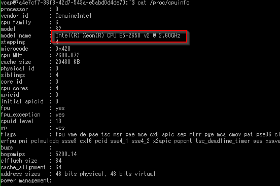

[トップページに戻る](../README.md) | [前回: 初めての Bluemix](201703_1st-step.md) | [次回: 初心に戻ってpushする](201703_3rd-scripts.md)

# 仮想マシンについて

## ベースとなるOS

[Bluemix のビルドパックを作る(1/3)](http://dotnsf.blog.jp/archives/1042099693.html) のページでは、2015年10月時点では Bluemix のスタックは Ubuntu 14.04.2 trusty (x86_64) です、とある。今でも同じだろうか？

2017年3月時点では Ubuntu 14.04.5 trusty (x86_64) がベースのようです。ちょっと新しくなっていますね。

## CPUの種類

x86_64 の CPU ってことですが、実際は何でしょうか？

Intel Xeon E5-2650 2.60GHz の 4コア CPU のようです。まあ、仕組みによってはハードウェア部分が仮想化されているかもしれないので、本当かどうかはちと怪しいですが。

Bluemix の料金表にメモリ量はあっても、CPU計算量が無いのが面白いです。bitcoin採掘プログラムのようにCPUヘビーなソフトを載せて、うまく動かし続けたら料金はどうなるんでしょう？まあ、メモリ量設定にあわせ、CPU時間も割り当てが調整されるのかもしれませんね。

## ディスク容量

仮想マシンのディスク(ストレージ)はどんな感じなんでしょうか。df -h コマンドで表示させてみます。

/tmp/lifecycle が大きく見えますが、実際には合計して 30MB 弱の実行ファイルが4つあるだけです。

/tmp/lifecycle/diego-sshd は [前回](201703_1st-step.md#さてどうなっているのか) の ps aux コマンドの結果にありましたね。今とても活用している ssh 接続用のサーバープログラム(deamon)でしょう。cf コマンドのいろいろな作業の受け口になっているかもしれませんね。

【追記】Diego はCFで DEA(Droplet Execution Agent) の新アーキテクチャの名。Droplet は 仮想マシンの原型のようなもので、DEA がビルドパックで生成した実行環境に、ユーザーのpushしたアプリを組み合わせて生成する。各仮想マシンはCFコンテナ(Warden)の上で、このDropletを実行している。

残りの builder, heathcheck, launcher が何をやっているのか、それはまた別の機会にしましょう。名前からすると、仮想マシンの初期設定、問題発生時の再起動、起動に関わってそうなんですけどね。どうでしょうか(笑)

【追記】「新しいDiegoの仕組み入門」スライドの24ページ右上に3つとも並んでました(笑)

/dev/shm はRAMディスクのようで [Linux Tips – RAMディスク（/dev/shm）のIO性能をチューニングに活用する方法](https://hesonogoma.com/linux/ramdiskperformance.html) あたりが詳しいです。サイズ大きく見えますが、使ったぶんしかメモリを使わないとのこと。あまり使っている例を知りませんし、実際に中身を見ても空ですので、気にしないことにします。

ちなみに -a オプションを増やして全て表示させると、/tmp/garden-init という謎の実行ファイル？が出現します。実際のサイズは 1.7MB 程なんですけどね。

【追記】Garden は仮想マシンを実現するCFコンテナ Warden のGo言語版らしい。つまりアプリの実行環境だった。

/tmp/lifecycle と /tmp/garden-init は同じボリューム(ファイルツリー)の一部をそれぞれマウントしたもの、って感じでしょうか？VLMとか詳しくないので、詳細はよくわかりませんが…

## メモリ容量

初期状態では仮想マシンに 256MB のメモリが割り振られています。GUIも使わないですし、サービスもほとんど上げてないのに多くね？と思って「サービス」メニューで確認したら、やっぱ余裕みたいです。

とりあえずメモリ容量を 128MB に下げてみました。ちなみに仮想マシンにログオンして free とかしても、全然関係ない値が出てしまいます。仮想マシンじゃなくて、それを実行する実マシンの情報っぽいですね。

## コンテンツ修正と再起動の影響

ちょっとコンテンツを修正してみます。まず

cf ssh "Node.js Test" -c "cat app/public/index.html" > index.html

で表示されるhtmlファイルをローカルPCに書き出して、テキストエディタ等で少し書き換えます。そして

type index.html | cf ssh "Node.js Test" -c "cat - > app/public/index.html"

と仮想マシン上のファイルに反映してみます。

おお！ちゃんとWeb画面の表示が変わりました。ここまでは素晴らしい。でも、仮想マシンを再始動させると… また修正前に巻き戻っちゃいます。しょんぼり。

つまり仮想マシン上でコンテンツ修正しても一時的なもので、ちゃんと修正したコンテンツを cf push しなさい、ってことでしょうね。

【追記】これは当然で、仮想マシンの上でいくら修正しても、保持されている原型(Droplet)には影響しないですから。影響するようだと、逆に障害時にイメージ壊れて大変ですね。

## 先人たちの偉業

と、ここで、幾つかのキーワードを見つけたので、いろいろググってたら… 先人たちの偉業を発見してしまった。昨日からの僕の疑問を 120% 解消してくれる、素晴らしいスライド達！

* [Cloud Foundryは何故動くのか](https://www.slideshare.net/jacopen/cloud-foundry-33851040)
* [Cloud Foundry V2を、もうちょっと深掘りしよう](https://www.slideshare.net/jacopen/c-fv2)
* [Cloud Foundryで学ぶ、PaaSのしくみ講座](https://www.slideshare.net/jacopen/paas-for-beginners)
* [Cloud FoundryでDockerも.NETも。新しいDiegoの仕組み入門](https://www.slideshare.net/jacopen/diego-45603123)
* [Cloud Foundry にアプリケーションを push する際の典型的な10のエラー](https://www.slideshare.net/nota-ja/cloud-foundry-push-10)

これらスライドを見た今、細切れだった知識が繋がり、やっと CF もしくは PaaS の全体像が見えた気がします！

なんか難しい問題集を苦労しながら、間違いだらけで解いていたら、すげー詳しい解説付きの回答集を見つけてしまった感じ。ここまで書いたメモ、間抜けすぎて恥ずかしいが、この回り道があったこそ良い資料に巡り会えたし、理解できたとも思えるので残しておきます。

## 今日はここまで

三連休の中日、素晴らしい資料を見つけたので、今日はCFを中心に、資料をゆっくり読んでみることにします。Bluemixでの作業(お遊び？)はまた明日！

[トップページに戻る](../README.md) | [前回: 初めての Bluemix](201703_1st-step.md) | [次回: 初心に戻ってpushする](201703_3rd-scripts.md)
