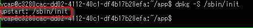

[トップページに戻る](../README.md) | [前回: 仮想マシンについて](201703_2nd-study.md)

# 初心に戻ってpushする

## 初心に戻る

アプリを作成したときのスタート地点、つまり「開始」タブのコンテンツに戻ってみましょう。Bluemix が勧めてくるのは、以下のように GitHub のサンプルをローカルにもってくることです。

```sh
git clone https://github.com/IBM-Bluemix/get-started-node
```

わざわざローカルに clone しなくても、GitHub サイトで内容を確認することができます。

[https://github.com/IBM-Bluemix/get-started-node](https://github.com/IBM-Bluemix/get-started-node)

## 仮想マシンの基本設定

昨日、仮想マシンのメモリ容量を変更した時に、以下のような警告が表示されました。


仮想マシンの設定は [manifest.yml](https://github.com/IBM-Bluemix/get-started-node/blob/master/manifest.yml) ファイルだそうです。Bluemix コンソール上でメモリ容量を修正しても、cf push してDroplet(仮想マシンの原型)を更新したら、このファイルの値で上書きされちゃうよ、ということですね。

```
---
applications:
 - name: GetStartedNode
   random-route: true
   memory: 256M
```

確かにメモリ容量が 256MB に設定されています。

random-route は「アプリケーションにランダムな経路を割り当てる」って説明がありますが、これは xxx.myblluemix.net というアクセス用の URL の xxx を自動で決めてくれる、のでしょうかね？

## アプリ起動の様子

OS 自体の起動は /sbin/init からで、upstart です。しかし /etc/init/\*.conf は多くあって、いちいち見てたら大変です。



まあこのあたりは Ubuntu の基本だしいいよね、ということで ps aux で確認できる app/.app-management/scripts/start は… [初日](201703_1st-step.md#さてどうなっているのか) で軽く見ましたね。

もう少し深く見るため、呼ばれている app/.app-management/utils/handler_utils.sh を見てみましょう。

```sh
#!/usr/bin/env bash
# IBM WebSphere Application Server Liberty Buildpack
# Copyright 2016 the original author or authors. (略)

function handler_port() {
  handler=$1
  param=$2
  default=$3
  INSTALL_DIR=$(cd `dirname ${BASH_SOURCE[0]}`/../.. && pwd)
  ruby <<-EORUBY
APP_MGMT_DIR = File.join('$INSTALL_DIR', '.app-management').freeze
\$LOAD_PATH.unshift File.expand_path(APP_MGMT_DIR, __FILE__)
require 'utils/handler_utils.rb'
config = Utils::HandlerUtils.get_configuration('$handler')
puts config['$param'] || $default
EORUBY
}

function enabled_handlers() {
  INSTALL_DIR=$(cd `dirname ${BASH_SOURCE[0]}`/../.. && pwd)
  ruby <<EORUBY
APP_MGMT_DIR = File.join('$INSTALL_DIR', '.app-management').freeze
\$LOAD_PATH.unshift File.expand_path(APP_MGMT_DIR, __FILE__)
require 'utils/enabled_handlers'
enabled = Utils.get_enabled_handlers
puts enabled.join("\n") unless enabled.nil?
EORUBY
}
```

これ、以下の app/.app-management/utils/handler_utils.rb と、

```rb
# Encoding: utf-8

require 'yaml'
require 'utils/simple_logger'

module Utils
  class HandlerUtils
    def self.get_configuration(handler_name)
      var_name      = environment_variable_name(handler_name)
      user_provided = ENV[var_name]
      if user_provided
        begin
          user_provided_value = YAML.load(user_provided)
          return user_provided_value if user_provided_value.is_a?(Hash)
          SimpleLogger.error("Configuration value in environment variable #{var_name} is not valid: #{user_provided_value}")
        rescue Psych::SyntaxError => ex
          SimpleLogger.error("Configuration value in environment variable #{var_name} has invalid syntax: #{ex}")
        end
      end
      {}
    end

    ENVIRONMENT_VARIABLE_PATTERN = 'BLUEMIX_APP_MGMT_'.freeze

    def self.environment_variable_name(handler_name)
      ENVIRONMENT_VARIABLE_PATTERN + handler_name.upcase
    end

    private_constant :ENVIRONMENT_VARIABLE_PATTERN
    private_class_method :environment_variable_name
  end
end
```

あと app/.app-management/utils/enabled_handlers.rb への sh用ラッパーって感じですね。

```ruby
#!/usr/bin/env ruby
# IBM SDK for Node.js Buildpack (略)
require 'utils/simple_logger'
module Utils

  # Returns the list of enabled handlers set in the environment
  def Utils.get_enabled_handlers
    if ENV['ENABLE_BLUEMIX_DEV_MODE'] == 'TRUE' || ENV['ENABLE_BLUEMIX_DEV_MODE'] == 'true'
      %w{devconsole inspector shell}
    elsif !ENV['BLUEMIX_APP_MGMT_ENABLE'].nil?
      ENV['BLUEMIX_APP_MGMT_ENABLE'].downcase.split('+').map(&:strip)
    else
      nil
    end
  end
end
```

そしてもうひとつ、app/.app-management/utils/get-node-executable があって hc とか inspector をチェックしています。

```sh
#!/usr/bin/env bash
# Encoding: utf-8
# IBM SDK for Node.js Buildpack (略)

# Usage:
#  get-node-executable break
#  get-node-executable no-break
#
# Exit codes:
# 0    : success
# other: an error occurred

app_management_dir=$(cd `dirname $0`/../ && pwd)
bp_dir=$(cd `dirname $0`/../.. && pwd)
cd $app_management_dir

source $app_management_dir/utils/node_utils.sh
source $app_management_dir/utils/handler_utils.sh

BREAK=$1

case "$BREAK" in
    'break' | 'no-break')
        ;;
    *)
        echo "Usage: $0 break or $0 no-break" >&2
        exit 1
        ;;
esac

enabled=($(enabled_handlers))

if [[ " ${enabled[*]} " == *" hc "* ]]; then
  node_cmd="node-hc"
else
  node_cmd="node"
fi

if [[ " ${enabled[*]} " == *" inspector "* ]]; then
    if inspector_builtin $bp_dir/vendor/node; then
        DEBUG_PORT=$(handler_port 'inspector' 'debugport' 9229)
        if [ "$BREAK" == "break" ]; then
            echo "${node_cmd} --inspect=${DEBUG_PORT} --debug-brk"
        else
            echo "${node_cmd} --inspect=${DEBUG_PORT}"
        fi
    else
        DEBUG_PORT=$(handler_port 'inspector' 'debugport' 5858)
        if [ "$BREAK" == "break" ]; then
            echo "${node_cmd} --debug-brk=${DEBUG_PORT}"
        else
            echo "${node_cmd} --debug=${DEBUG_PORT}"
        fi
     fi
 else
     if [ "$BREAK" == "break" ]; then
        echo "Node Inspector is not running; cannot suspend." >&2
        exit 2
    else
        echo "${node_cmd}"
    fi
fi
```

なんか面倒なことしてんなー、と。でも Node.js 環境なので、Web などへの応答はハンドラー(handlers)が担っているんですよね。なので起動時にそれを指定できる仕組みが必要なのかな、それを汎用的にした仕組みなのかな、と理解してます。

また hc が指定されると利用されると node の代わりに node-hc が実行されますが、これが利用されると「IBM SDKに含まれたHealth Centerエージェントが起動し、統計情報をMQTTブローカーに送る」と [このページ](https://www.ibm.com/developerworks/community/blogs/sxa/entry/node_monitoring_with_ibm_healthcenter) に書いてありました。

あまりゆっくり見ていくのもアレですが、どうやらお世話になっているらしい app/.app-management/utils/simple_logger.rb を最後に見ておきます。

```ruby
# Encoding: utf-8
module Utils
  class SimpleLogger
    class << self
      def warning(msg)
        $stderr.puts "Warning: #{msg}"
      end
      def error(msg)
        $stderr.puts "Error: #{msg}"
      end
      def info(msg)
        $stdout.puts msg.to_s
      end
    end
  end
end
```

まあ今回の実行環境は、handlers の設定は全然されてなくて、単にデフォルトの npm が起動して、package.json の start 定義に従って node app.js を起動しただけ、みたいなんですけどね…


## そして初心に戻る

えらく長い回り道をしてしまいましたが、初心に戻って Git でサンプルアプリを入手してみます。まずは [Gitをインストール](https://opcdiary.net/?page_id=27065) して、

```sh
git clone https://github.com/IBM-Bluemix/get-started-node
npm install
npm start
```


うん、問題なく動作してます。では引き続き、Bluemix 環境に上げてみましょう。manifest.ymlの中身は、アプリ名もメモリ量も違うんですが、気にせずやってみます。

```sh
cf push "Node.js Test"
```

いろいろ表示が出ましたが、問題なく更新された模様。


指定したからなのか、アプリ名はそのままでした。でもインスタンスのメモリ量は256MBに戻っちゃいましたね。あと、使用ディスク量が30MBほど増えたかな？


2日ほど回り道したおかげで、何やってるかよくわかって感慨深いです。push の時に表示されたメッセージも記念に残しておきましょうか。

```
C:\work\bm\get-started-node>cf push "Node.js Test"
Using manifest file C:\work\bm\get-started-node\manifest.yml

Updating app Node.js Test in org xxxxx / space dev as ********...
OK

Uploading Node.js Test...
Uploading app files from: C:\work\bm\get-started-node
Uploading 7.2K, 7 files
Done uploading
OK

Stopping app Node.js Test in org xxxxx / space dev as *******...
OK

Starting app Node.js Test in org xxxxx / space dev as ********...
Downloading liberty-for-java_v3_7-20170118-2046...
Downloading dotnet-core_v1_0_6-20161205-0912...
Downloading xpages_buildpack...
Downloading liberty-for-java_v3_5-20161114-1152...
Downloading php_buildpack...
Downloaded python_buildpack
Downloaded liberty-for-java_v3_5-20161114-1152
Downloading binary_buildpack...
Downloaded liberty-for-java_v3_7-20170118-2046
Downloaded xpages_buildpack
Downloading staticfile_buildpack...
Downloading liberty-for-java_v3_4_1-20161030-2241...
Downloaded dotnet-core_v1_0_6-20161205-0912
Downloading swift_buildpack_v2_0_3-20161217-1748...
Downloaded binary_buildpack
Downloaded php_buildpack
Downloading sdk-for-nodejs...
Downloaded swift_buildpack_v2_0_3-20161217-1748
Downloading ruby_buildpack...
Downloading noop-buildpack...
Downloaded sdk-for-nodejs_v3_9-20161128-1327
Downloading java_buildpack...
Downloaded liberty-for-java
Downloading nodejs_buildpack...
Downloaded ruby_buildpack
Downloading go_buildpack...
Downloaded sdk-for-nodejs
Downloading dotnet-core...
Downloaded noop-buildpack
Downloaded nodejs_buildpack
Downloaded java_buildpack
Downloaded swift_buildpack
Creating container
Downloading app package...
Downloaded app package (7.3K)
Downloaded build artifacts cache (2.9M)
Staging...
-----> IBM SDK for Node.js Buildpack v3.10-20170119-1146
       Based on Cloud Foundry Node.js Buildpack v1.5.24
-----> Creating runtime environment

       NPM_CONFIG_LOGLEVEL=error
       NPM_CONFIG_PRODUCTION=true
       NODE_MODULES_CACHE=true
-----> Installing binaries
       engines.node (package.json):  4.*
       Resolving node version 4.* via 'node-version-resolver'
       Installing IBM SDK for Node.js (4.7.2) from cache
       Using default npm version: 2.15.11
-----> Restoring cache
       Loading 2 from cacheDirectories (default):
       - node_modules
-----> Checking and configuring service extensions before installing dependencies
       Installing node modules (package.json)
-----> Checking and configuring service extensions after installing dependencies
-----> Installing App Management
-----> Caching build
       Clearing previous node cache
       Saving 2 cacheDirectories (default):
       - node_modules
       - bower_components (nothing to cache)
-----> Build succeeded!
       ├── body-parser@1.17.1
       ├── cloudant@1.7.1
       ├── dotenv@4.0.0
       └── express@4.15.2

       ├── cfenv@1.0.4
Staging complete
Uploading droplet, build artifacts cache...
Uploading build artifacts cache...
Uploading droplet...
Uploaded build artifacts cache (2.9M)
Uploaded droplet (19.5M)
Uploading complete
Destroying container

0 of 1 instances running, 1 starting
0 of 1 instances running, 1 starting
1 of 1 instances running

App started


OK

App Node.js Test was started using this command `./vendor/initial_startup.rb`

Showing health and status for app Node.js Test in org xxxxx / space dev as ********...
OK

requested state: started
instances: 1/1
usage: 256M x 1 instances
urls: rtk-test-node.mybluemix.net
last uploaded: Sun Mar 19 12:29:26 UTC 2017
stack: cflinuxfs2
buildpack: SDK for Node.js(TM) (ibm-node.js-4.7.2, buildpack-v3.10-20170119-1146)

     state     since                    cpu    memory          disk          details
#0   running   2017-03-19 09:30:41 PM   0.0%   61.5M of 256M   84.4M of 1G
```

ログを眺めてると、Droplet を作る様子がなかなか面白いですね。サイズは19.5MBだってさ。

go や ruby はともかく、xpages, liberty, java, swift なんて必要なのかなぁ？なんかまだ無駄が多いビルドパックな気がするんですが… 差分ファイルシステムだから、それほど気にしなくても良いのかもしれないけれども。

## 最後に initial_startup.rb

今日の締めとして、起動メッセージの最後に出る app/vendor/initial_startup.rb を眺めておきましょう。

```ruby
#!/usr/bin/env ruby
# IBM SDK for Node.js Buildpack
# Copyright 2014 the original author or authors. (略)

# points to /home/vcap/app
app_dir = File.expand_path('..', File.dirname(__FILE__))

app_mgmt_dir = File.join(app_dir, '.app-management')

$LOAD_PATH.unshift app_mgmt_dir

require 'json'
require 'utils/enabled_handlers'
require 'utils/handlers'
require 'utils/simple_logger'

def start_runtime(app_dir)
  exec(".app-management/scripts/start #{ENV['PORT']}", chdir: app_dir)
end

def start_proxy(app_dir)
  exec('.app-management/bin/proxyAgent', chdir: app_dir)
end

def get_environment(app_mgmt_dir, app_dir)
  env = {}
  env['BOOT_SCRIPT'] = ENV['BOOT_SCRIPT']
  env['BLUEMIX_DEV_CONSOLE_HIDE'] = '["stop"]'
  env['BLUEMIX_DEV_CONSOLE_START_TIMEOUT'] = '500'
  if system "bash -c \"source #{app_mgmt_dir}/utils/node_utils.sh && inspector_builtin #{app_dir}/vendor/node\""
    env['BLUEMIX_DEV_CONSOLE_TOOLS'] = '[ {"name":"shell", "label":"Shell"} ]'
  else
    env['BLUEMIX_DEV_CONSOLE_TOOLS'] = '[ {"name":"shell", "label":"Shell"}, {"name": "inspector", "label": "Debugger"} ]'
  end
  env
end

def run(app_dir, env, handlers, background)
  if handlers.length != 0
    command = handlers.map { | handler | handler.start_script }.join(' ; ')
    command = "( #{command} ) &" if background
    system(env, "#{command}", chdir: app_dir)
  end
end

def run_handlers(app_mgmt_dir, app_dir, handlers, valid_handlers, invalid_handlers)
  Utils::SimpleLogger.warning("Ignoring unrecognized app management utilities: #{invalid_handlers.join(', ')}") unless invalid_handlers.empty?
  Utils::SimpleLogger.info("Activating app management utilities: #{valid_handlers.join(', ')}")

  # get environment for handlers
  env = get_environment(app_mgmt_dir, app_dir)

  # sort handlers for sync and async execution
  sync_handlers, async_handlers = handlers.executions(valid_handlers)

  # execute sync handlers
  run(app_dir, env, sync_handlers, false)

  # execute async handlers
  run(app_dir, env, async_handlers, true)
end

def write_json(file, key, value)
  hash = JSON.parse(File.read(file))
  hash[key] = value
  File.open(file,"w") do |f|
    f.write(hash.to_json)
  end
end

handler_list = Utils.get_enabled_handlers

if handler_list.nil? || handler_list.empty?
  # No handlers are specified. Start the runtime normally.
  start_runtime(app_dir)
else
  handlers_dir = File.join(app_mgmt_dir, 'handlers')

  handlers = Utils::Handlers.new(handlers_dir)

  # validate headers
  valid_handlers, invalid_handlers = handlers.validate(handler_list)

  # check if proxy agent is required
  proxy_required = handlers.proxy_required?(valid_handlers)

  if proxy_required
    # check instance index
    index = JSON.parse(ENV['VCAP_APPLICATION'])['instance_index']
    if index != 0
      # Start the runtime normally. Only allow dev mode on index 0
      start_runtime(app_dir)
    else
      # Run handlers
      run_handlers(app_mgmt_dir, app_dir, handlers, valid_handlers, invalid_handlers)

      # Start proxy
      write_json(File.join(app_mgmt_dir, 'app_mgmt_info.json'), 'proxy_enabled', 'true')
      start_proxy(app_dir)
    end
  else
    # Run handlers
    run_handlers(app_mgmt_dir, app_dir, handlers, valid_handlers, invalid_handlers)

    # Start runtime
    start_runtime(app_dir)
  end
end
```

## 今日はここまで

いろいろ見て回って、最後に初心に帰ったところで、この3日間の Bluemix お試しの旅は一応、一区切りです。実際にアプリを書いて、仮想サーバーを更新していくことはできそうです。

変に遠回りしなければ、1時間もあれば push まで行けたかもしれないですね(苦笑)

まあ、いいんです、こうやって苦労するのも楽しみのうちです。良い資料にも出会えましたし！

しかし、使ってみたら思ってたよりも良いものでした。もう遊んで、もう少し慣れたら、仕事でも使ってみようと思っています。

[トップページに戻る](../README.md) | [前回: 仮想マシンについて](201703_2nd-study.md)
