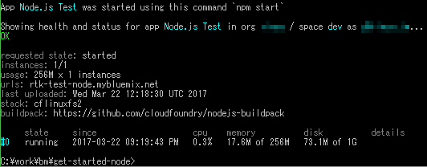

[トップページに戻る](../README.md) | [前回: 初心に戻ってpushする](201703_3rd-scripts.md) | [次回: 最小の Node.js 環境を作ってみる](201703_5th-base.md)

# Node.js 環境に慣れる

## 新しいバージョンを使いたい

Node.js の入門資料を読んでいたら、ES2017のasync/awaitがすごく便利そうに見えたんですよね。

調べてみたら V8 JavaScript Engine の v5.2.328 からサポートされているらしい。[Node.jsのリリース一覧](https://nodejs.org/ja/download/releases/) によると、Node.js の v7.0.0 以降なら使えるらしいです。

よーし！と思ったが、Bluemix 上の私の Node.js 環境は v4.x でした。しかも最新が v6.7.x らしい… ダメじゃん。

## Twitter ってすげえ

流行りのプラットフォームなのに、対応が遅いのが残念で、以下のように呟いたわけですよ


するとリツイートされて、数時間後には IBMの中のひと(たぶん)から [アドバイス](https://twitter.com/ibmamnt/status/844490789266714624) が！


## ビルドパックを探せ

Bluemix のカタログでは、コンテナには「独自の Docker イメージをアップロードしてください」ってあるのにCFにはビルドパックについて書いてなくて。他から持ってこれるとは思ってませんでした。

アドバイスを受けて cf コマンドのオプションでビルドパックの指定ができることに気がつき、ビルドパックを探してみたわけです。で、Github 上にこれ見つけました。

* [cloudfoundry/nodejs-buildpack](https://github.com/cloudfoundry/nodejs-buildpack)

[manifest.yml](https://github.com/cloudfoundry/nodejs-buildpack/blob/master/manifest.yml) を見ると、node 7.6.0 の定義があり、大丈夫そうです。コレでいってみましょう。

## ビルドパックを使え

新しいバージョンの Node.js を使いたい！が目的なので、手元のアプリ用フォルダにある package.json をテキストエディタで開き、バージョン指定を 4.\* から 7.\* に書き換えます。


そしてフォルダ内で cf コマンド！

```sh
cf push "Node.js Test" -b https://github.com/cloudfoundry/nodejs-buildpack
```

以下が出力の最後の部分ですが、イケましたかね？アプリも問題なく動作しているようですよ！



## 新機能を試せ

いや、確かにうまくいった気がするのですが、ホントかな？と。サーバーのバージョンを上げても、アプリの見た目は変わらないですからね。

なのでネットで見つけた以下の await 命令のサンプルを server.js の途中に追加してみました。まあ意味はないんですが、確認なのでわかりやすさ重視で。

```js
const wait = (delay) => {
  return new Promise(resolve => setTimeout(resolve, delay));
}
async function testWait () {
  console.log('testWait: Start');
  await wait(5000);
  console.log('testWait: 1');
  await wait(5000);
  console.log('testWait: 2');
  await wait(5000);
  console.log('testWait: End');
}
testWait();
```

node に --harmony-async-await オプションが必要、かと思いましたが、v7.6 からは不要になったということで省略。

そして cf push アゲイン！実行ログを見てみます。


おおっ！ちゃんとログに出てる、しかも 5秒おきだ！素晴らしいでヤンス。

## 今回はスムーズに終了

というわけで、今回は中のひとのアドバイスのおかげで、ほとんど苦労なく Node.js の v7.6 環境を利用することができました。CF すごいな。

Takehiko Amano さんに深く感謝しつつ、今日は早めに寝まーす。

[トップページに戻る](../README.md) | [前回: 初心に戻ってpushする](201703_3rd-scripts.md) | [次回: 最小の Node.js 環境を作ってみる](201703_5th-base.md)
