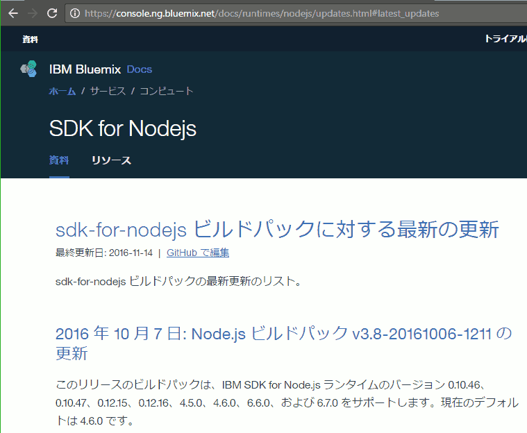

[トップページに戻る](../README.md) | [前回: Node.js 環境に慣れる](201703_4th-nodejs.md)

# 最小の Node.js 環境を作ってみる

ここ数日で、Bluemix 環境についてだいぶ理解できました。僕は Node.js も初心者のため、そこも学ばないといけないのですが、まだ express の利用は早い気がします。Node.js と express の知識が混じってしまいそうで…

そこで自分の学習用に、Node.js だけのシンプルな環境を作成してみます。

## 最初は manifest.yml ファイル

まずは仮想サーバーの構成を決める manifest.yml ファイルです。自動生成されたものをベースに、最低限必要そうな項目を並べてみます。

```
applications:
- path: .
  name: rtk-node-try1
  domain: mybluemix.net
  random-route: true
  instances: 1
  memory: 128M
```

アプリ名(name)は "rtk-node-try1" とし、仮想サーバー数(instances)は 1、メモリ容量(memory)は 128MB としました。

## アプリ環境は package.json ファイル

Node.js の実行環境は package.json ファイルです。これは以下のようにしてみました。

```json
{
  "name": "rtk-node-try1",
  "main": "server.js",
  "description": "Simple Node.js apps on the Bluemix platform",
  "version": "0.0.1",
  "private": false,
  "engines": {
    "node": "7.*"
  },
  "scripts": {
    "start": "node server.js"
  },
  "dependencies": {
  },
  "author": "Toshio Yamashita",
  "license": "MIT"
}
```

## 最低限のサンプルアプリ

さて、次は実際に実行される server.js を用意します。

```js
var updateKey = "2017/03/25 16:30";

var http = require("http");

var server = http.createServer(function (req, res) {
	res.writeHead(200, {"Content-Type": "text/plain"});
	res.end("hello, world!\n\n" + updateKey);
});

var port = process.env.PORT || 3000;
server.listen(port, function() {
    console.log(updateKey + ": To view your app, open this link in your browser: http://localhost:" + port);
});
```

よく見かける Hello World 系のアプリに、更新時間の表示を追加したものです。

うまく更新できない可能性を考え、push する際に updateKey を更新しておきます。この方法はベタで少し手間もかかりますが、問題判別が容易で、新しい環境に慣れるまでの僕の癖のようなものです。

## その他のファイル

あとは cf push の対象から外すファイルを .cfignore ファイルに記述し

```
node_modules/
*.DS_Store
README.md
.github/
.git/
.gitignore
logs
*.log
```

とりあえずは使いませんが、git リポジトリに反映したくないファイルを .gitignore ファイルに記述します。

```
node_modules
```

これで最低限必要と思われる5ファイルが、PC上に用意できました。


## pushしてみる

さて、用意した5ファイルを使って、Bluemix仮想サーバーを作成してみましょう。まずは Bluemix で SDK for Node.js のビルドパックを使った(いやたぶん何でもいいけど)アプリを新規作成します。そして起動したら…

5ファイルを配置したディレクトリで、cf コマンドを実行します。

```
cf api https://api.ng.bluemix.net
cf login
cf push rtk-node-try1
```

うまく push できたようです。


Bluemix 上のランタイム表示もメモリ容量 128MB に変化し、ログもちゃんと表示されました。


Web ブラウザで確認すると、ちゃんと Hello World できているようですね。


以上、最低限の Node.js ver7.x 実行環境を準備できたみたいです。今回の5ファイルはベース環境として、zip かけて保存しておくことにします。

## あれ？

と、ここで気がつきました。僕は今回、ビルドパックの指定をしていません…

むろん Bluemix というか、CF の仕組みとして、package.json ファイルがあれば SDK for Node.js ビルドパックを自動選択してくれるのは良いのですが…

今回は package.json で　v7.x を指定しており、でもちゃんと node.js-7.7.4 が設定されたんですよね。buildpack-v3.10-20170119-1146 がちゃんと仕事してくれたみたい。

あれ、では [前回](201703_4th-nodejs.md) の僕の苦労はなんだったの？



日本語のドキュメントが古っ！ビルドパックが更新されても、僕みたいな初心者は、ドキュメント古かったら気がつかないよ！

まあ僕もドキュメント更新は苦手だから、あまり責められないけどさ… orz…

リンク先の Github 情報は更新されているので、今後は、英語だけどココを参照するのが良さそうだ。

## 少し実装してみよう

最低限の環境ができたところで、少し機能を実装してみましょう。典型的な API 利用例です。

先ほどのディレクトリで [node-rest-client](https://www.npmjs.com/package/node-rest-client) モジュールを追加してみます。


package.json に Repository が無いと警告が出てしまいましたが、-save オプションで package.json は更新してくれています。

必要なパッケージが導入されたところで、server.js の http.createServer の部分を以下のように書き換えます。

```js
var Client = require('node-rest-client').Client;
var client = new Client();

var server = http.createServer(function (req, res) {
	client.get("https://api.github.com/zen", function (data, response) {
		res.writeHead(200, {"Content-Type": "text/plain"});
		res.end("hello, world!\n\n" + updateKey + "\n\n" + data);
	});
});
```

\/zen は Github の API のうち、英語の格言をランダムに入手できる API で、テスト実装にとても便利です。さて、変更を push して実行してみましょう。


あれ、エラー文が表示されていますね。User-agent を指定しないと駄目だそうです。というわけで、以下のように client.get の引数に指定します。

```js
var Client = require('node-rest-client').Client;
var client = new Client();

var server = http.createServer(function (req, res) {
	client.get("https://api.github.com/zen", {headers: {"User-Agent": "rtk-node-try1-app"}}, function (data, response) {
		res.writeHead(200, {"Content-Type": "text/plain"});
		res.end("hello, world!\n\n" + updateKey + "\n\n" + data);
	});
});
```

もう一度、変更を push して実行してみましょう。


うん、今度はちゃんと英語の格言らしきものが表示されましたよ！しかもリロードするたび格言が変わります。大丈夫のようですね！

## ローカルで実行してみる

修正するたび push するのも大変なので、ローカルで起動して動作を試してみましょう。順番が逆な気もしますが、まあ気にせず…

PCに Node.js がインストール済みであれば、push したディレクトリで node server.js と実行すればローカルでアプリが起動します。


localhost に Web ブラウザでアクセスすれば、仮想サーバーと同様に動作を確認できます。


コードを更新した時、コンソールの node を再起動するだけで変更が反映されるので、とてもクイックにコーディングと動作確認が進められます。

## 今日はここまで

なんか今日は特に詰まらず、すっきりと進みました。朝、ゆっくり寝坊できたからでしょうか。

これで Node.js を使ったアプリを、Bluemix で提供する、ということでは、最初の敷居を乗り越えた気がします。たぶん、ええ、きっと。そうだといいなぁ。

[トップページに戻る](../README.md) | [前回: Node.js 環境に慣れる](201703_4th-nodejs.md)
