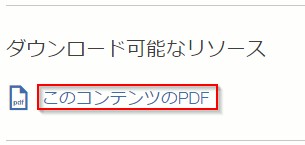
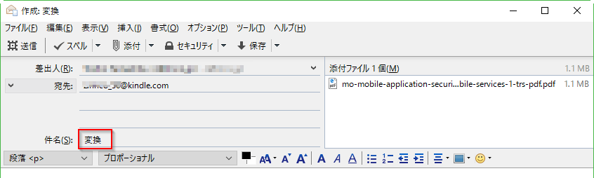
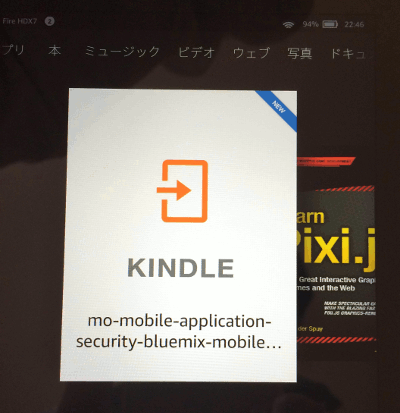

[トップページに戻る](../README.md)

# Kindleで英語記事を読む

## Kinde で PDF を読む

IBM の [developerWorks JP](https://www.ibm.com/developerworks/jp/) サイトの記事には、PDF化された記事があることが多いです。

Amazon サイトで Kindle ごとに設定された "Send-to-kindlle" メールアドレスにこのPDFファイルを送るだけで、対象の Kindle に配信され読めるようになります。

さて、ここまでは Kindle 使いの常識デスネ！

## 英語 PDF を変換する

さて、記事を PDF 化する仕組みは、本家の [developerWorks](https://www.ibm.com/developerworks/) サイトにもあります。ここで英語の PDF 記事をダウンロードしましょう。

先ほどと同じようにメールで Kindle 端末に送るのですが、ここで1つ大事なことがあります。

メールの件名(Subject)に **変換** の漢字2文字を入力してください。

この指定をすると、Amazon のほうで、PDF を自動的に Kindle コンテンツの形式に変更してくれます。日本語のコンテンツでも文字サイズが変更出来たり便利な機能なんですが、英語のコンテンツでは、これは特に重要なんです！

## 英語 PDF を読む

さて、Kindle に記事が届きましたので、読んでみましょう。

なんと！わからない英単語をタップしたら英和辞書が出てきました！

そう PDF から変換したのは、この辞書機能が使いたかったからなんです。

## けっこうお勧めです

英語が得意な方ならともかく、英語コンテンツを読むのはなかなか労力がかかります。でも Kindle に入れておけば、なにかのついでに読めますし、お洒落なカフェでも英語コンテンツは格好良いですよ。

そして通常の英語書籍と同様に、わからない単語をすぐ調べられるのはとても楽なんです。

これで最新の技術情報を仕入れて、どんどん先に進んでいきたいですよね。

[トップページに戻る](../README.md)
